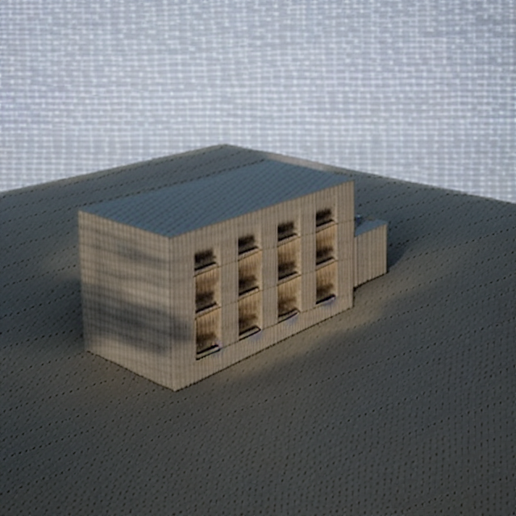

# Architech Render — SketchUp 多重控制圖 AI 渲染外掛

在 SketchUp 內部擷取 **beauty / hidden-line edge / fog depth** 三張像素對齊的控制圖，
一起餵給 ControlNet，以求在 AI 算圖時保住建築的結構。



---

## 這個外掛在解決什麼問題

市面上多數 SketchUp AI 渲染外掛只送一張 viewport 截圖給 img2img，
模型必須自己猜結構，結果常見牆面歪斜、開口數量改變、透視線跑掉。

外掛跑在 SketchUp **行程內部**，可以主動切換 rendering options 產生多張控制圖：

| Pass | 內容 | 用途 |
|---|---|---|
| **beauty** | 使用者當前樣式 | img2img 的底圖 |
| **edge** | 單色 + 黑邊線（白底黑線） | 幾何邊界，含遮擋正確的隱藏線 |
| **depth** | fog 深度圖 | **精確線性的公制深度**（實測誤差 ≤ ±0.5 灰階） |

三張圖的取景完全一致 —— `write_image` 的取景只由輸出尺寸決定，
所以同尺寸即像素對齊，不需要任何額外機制。

---

## 快速開始

### 需求
- SketchUp 2026（macOS）
- Python 3.11+
- 約 8 GB 磁碟空間（模型 6.6 GB + 虛擬環境 1 GB）

### 安裝

**【終端機】**

```bash
git clone git@github.com:cbtzeng/sketchup-ai-render-prototype.git
cd sketchup-ai-render-prototype

# 1. 建立生成環境
python3 -m venv .venv-gen
./.venv-gen/bin/pip install torch torchvision diffusers transformers accelerate safetensors pillow

# 2. 下載模型（SD1.5 + Canny/Depth ControlNet，約 6.6 GB）
./.venv-gen/bin/python tools/download_models.py

# 3. 安裝外掛（符號連結，改程式碼不用重裝）
./tools/install_dev.sh
```

重啟 SketchUp。若載入政策設為「僅載入已識別的擴充功能」，
需改為允許所有擴充功能（SketchUp → Settings → Extensions → Loading Policy）。

### 使用

1. 在 SketchUp 中把鏡頭調到想要的角度（**模型裡要有幾何**，空模型只會擷取到預設人形）
2. **Extensions → Architech Render**
3. 輸入 prompt、選風格 preset、調 fidelity 滑桿
4. 按 **Render**

擷取時 SketchUp 視窗會閃三次（切換顯示樣式），設定會自動還原。
單張約 60 秒，首次含載入模型約 90 秒。

**成品位置**：`~/Documents/ArchitechRender/<日期_時間>/result.png`

### fidelity 滑桿

只有一個旋鈕，內部映射到兩個 ControlNet 權重。`denoise` **固定 0.75 不隨它變動** ——
那是刻意的：denoise 決定「外觀能重畫多少」，控制圖權重決定「幾何要多貼合」，
兩者是獨立的軸。綁在一起會抵銷掉 ControlNet 的用處（推理見
[journal 009](docs/journal/main/009-fidelity-滑桿的映射.md)）。

| fidelity | edge 權重 | 效果 |
|---|---|---|
| 0.0 | 0.55 | 結構較鬆，但仍認得出是同一棟建築 |
| 0.6（預設） | 0.82 | 結構完整，材質光影被重畫 |
| 1.0 | 1.00 | 最貼合原始幾何 |

下限訂在 0.55 而非 0：實測 0.48 時建築量體整個跑掉，
產出不再是「這棟建築的算圖」而是「用這張圖當靈感重新生成」。

---

## 專案結構

```
src/architech_render/       Ruby 外掛（薄層：擷取、UI、跨行程呼叫）
  capture/                    三 pass 擷取，含 ensure 保證還原
  net/                        生成後端（本機 / 雲端）、HTTP、雜湊
  ui/                         HtmlDialog 面板與唯一的前後端路由
  ui_assets/                  純 HTML/CSS/JS，無外部 CDN
cloud/                      雲端層（已完成但未部署）
  lib/                        job 狀態機、成本護欄、provider 介面
  api/v1/                     五個端點
  supabase/migrations/        三份 migration
eval/                       評估工具
  metrics/                    Canny、Edge F-score、depth 相關性
  providers/                  本機生成（diffusers + MPS）
tools/spike/                實機驗證腳本（Phase 0 的產物）
docs/journal/               決策紀錄（9 篇）
test/run_tests_staged.rb    唯一的測試入口
```

### 為什麼 Ruby 層要薄

SketchUp 的 Ruby 跑在**主 UI 執行緒**，任何同步等待都會凍結使用者的 SketchUp。
而且外掛更新要靠重裝，把邏輯放外面才能改。

---

## 測試

**【Ruby Console】**（Extensions → Developer → Ruby Console）

```ruby
load '/path/to/repo/test/run_tests_staged.rb'
```

**【終端機】**

```bash
python3 -m pytest eval/tests -q      # 80 個評估指標測試
cd cloud && npm test                 # 215 個雲端層測試
```

不使用 minitest 的 runner —— 實測 `Minitest.run` 會掛住 SketchUp，
且 `$stdout` 是 `Sketchup::Console`（`puts` 為 private method）。
現行 runner 自己跑迴圈、每步先 print 再執行。

---

## Phase 0：先驗證，再動工

動工前把所有 SketchUp API 的未知先在實機上驗完，結果記在
[docs/sketchup-api-feasibility.md](docs/sketchup-api-feasibility.md)，
用 🟢 確定 / 🟡 待查 / 🔴 需驗證 標示。**🔴 從 10 項降到 2 項。**

幾個對設計有決定性影響的結果：

- **`write_image` 的取景只由輸出尺寸決定**（垂直 FOV 固定）。
  `camera.aspect_ratio` 對它完全無效 —— 三 pass 同尺寸即對齊，
  原本擔心的最高風險項反而是最簡單的一項。
- **fog 是精確線性的公制深度**。12 個標定點誤差全部 ≤ ±0.5 灰階（即量化誤差本身），
  可無損反推公尺數。這比 MiDaS 的相對視差更精確。
- **rendering_options 的改動不進 undo stack、不會把 model 標成 dirty**。
  好消息是不干擾使用者的編輯歷史；壞消息是 **SketchUp 不會幫我們還原任何東西** ——
  `ensure` 區塊是唯一防線。
- **SketchUp 的 Ruby 幾乎沒有原生擴充檔**，`require 'digest'` 可能失敗。
  所以雜湊改為執行期實測三層後備（`digest` → `openssl` → 純 Ruby）。

---

## 已知限制

**記憶體競爭（互動情境中無法避免）**
MPS 是統一記憶體，而使用者按 Render 時 SketchUp 本來就開著。
實測一次生成在資源被佔用時從 60 秒拉長到 913 秒。
跑批可以事先關掉其他程式，互動使用沒辦法這樣要求。
**這是把生成移到雲端的主要理由 —— 不是為了速度，是為了不跟使用者的 SketchUp 搶記憶體。**

**生成品質天花板**
SD1.5 在 640² 的產出是「算圖」而不是「截圖」，但離 photoreal 還有距離。
換 SDXL 或提高解析度會改善，代價是記憶體：實測 768² 只比 640² 多 1.44 倍像素卻慢 7 倍（換頁）。

**雲端層未部署**
job 狀態機、成本護欄、Supabase schema 已完成並通過 215 個測試，
但沒有寫 Supabase adapter 也沒有部署。生成目前走本機。

**評估樣本不足**
只有 2 個程式產生的場景，缺曲面、大面積玻璃、細長構件 ——
而那些正是最容易讓結構走鐘的情境。[eval/report.md](eval/report.md) 的數字只能當方向參考。

---

## 設計文件

| 檔案 | 內容 |
|---|---|
| [docs/COLLABORATION_REPORT.md](docs/COLLABORATION_REPORT.md) | **與 AI 協作的關鍵對話與判斷分歧** |
| [docs/spec.md](docs/spec.md) | 使用者流程、Non-goals、可量化驗收標準 |
| [docs/architecture.md](docs/architecture.md) | 模組拆解、job 狀態機、成本護欄 |
| [docs/sketchup-api-feasibility.md](docs/sketchup-api-feasibility.md) | API 可行性，含信心標示 |
| [docs/critique.md](docs/critique.md) | **對本方案自身論點的七點反駁** |
| [docs/journal/](docs/journal/) | 9 篇決策紀錄，含被否決的選項 |

---

## 規模

58 commits · Ruby 4,583 行 / 28 檔 · TypeScript 30 檔 · Python 29 檔 ·
文件 23 份 · 決策紀錄 9 篇 · 測試 295 個（評估 80 + 雲端 215）
